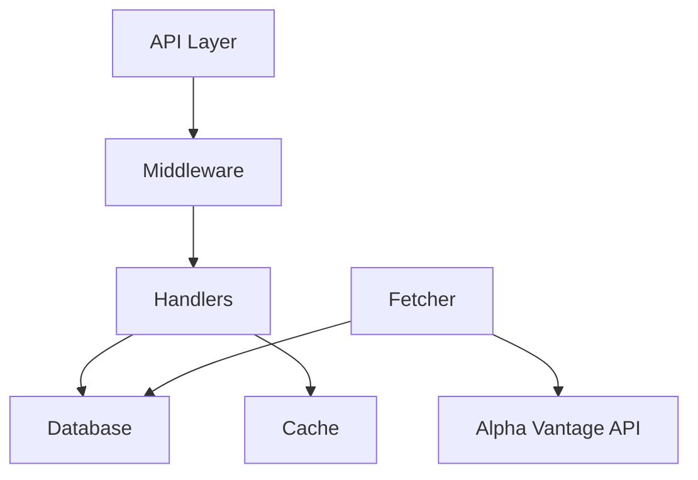

# 

[](https://golang.org)
[](https://nextjs.org)
[](https://opensource.org/licenses/MIT)
[](http://makeapullrequest.com)

```
  ██╗   ██╗ ██████╗ ██╗      █████╗ ████████╗██████╗ ██╗ █████╗ 
  ██║   ██║██╔═══██╗██║     ██╔══██╗╚══██╔══╝██╔══██╗██║██╔══██╗
  ██║   ██║██║   ██║██║     ███████║   ██║   ██████╔╝██║███████║
  ╚██╗ ██╔╝██║   ██║██║     ██╔══██║   ██║   ██╔══██╗██║██╔══██║
   ╚████╔╝ ╚██████╔╝███████╗██║  ██║   ██║   ██║  ██║██║██║  ██║
    ╚═══╝   ╚═════╝ ╚══════╝╚═╝  ╚═╝   ╚═╝   ╚═╝  ╚═╝╚═╝╚═╝  ╚═╝
```

<div align="center">
  <p><em style="color: #00F5FF;">Real-time stock market data visualization and analysis</em></p>
</div>

## 📋 Overview

Volatria is a modern, real-time stock market dashboard built with Next.js frontend and Go backend. It provides real-time stock data, historical charts, and watchlist functionality with a focus on performance and user experience.

## 🏗️ Architecture

### Frontend (Next.js)
| Component | Technology |
|-----------|------------|
| Framework | Next.js 14 with App Router |
| UI | Custom components with modern design |
| State | React Context API |
| Data Fetching | SWR for real-time data |
| Charts | Custom chart implementation |
| Styling | Tailwind CSS |

### Backend (Go)
| Component | Technology |
|-----------|------------|
| API Framework | Gin |
| Database | SQLite with WAL mode |
| Data Source | Alpha Vantage API |
| Caching | In-memory cache with TTL |
| Rate Limiting | Per-IP rate limiting |
| Circuit Breaker | Automatic service recovery |
| Metrics | Performance monitoring |

## ✨ Features

- 📈 Real-time stock price updates
- 📊 Historical price charts
- ⭐ Watchlist management
- 🔐 User authentication
- ⚡ Rate limiting and circuit breaking
- 📊 Performance metrics
- 🔄 CORS support
- 🔄 Concurrent data fetching

## 🛠️ Technical Details

### Backend Architecture


### Performance Optimizations
- 🔄 Connection pooling
- ⚡ Query optimization
- 💾 Caching layer
- 🔄 Concurrent data fetching
- ⏱️ Rate limiting
- 🛡️ Circuit breaking

## 🚀 Getting Started

### Prerequisites
- Go 1.21+
- Node.js 18+
- SQLite3

### Backend Setup
```bash
# Clone the repository
git clone https://github.com/yourusername/volatria.git
cd volatria

# Install dependencies
go mod download

# Run the server
go run main.go
```

### Frontend Setup
```bash
# Navigate to frontend directory
cd frontend

# Install dependencies
npm install

# Run development server
npm run dev
```

## 🔌 API Endpoints

### Public Routes
| Endpoint | Method | Description |
|----------|--------|-------------|
| `/login` | POST | User authentication |
| `/stocks/:symbol` | GET | Get latest stock price |
| `/stocks/:symbol/chart` | GET | Get historical data |
| `/stocks` | GET | Get popular stocks |

### Protected Routes
| Endpoint | Method | Description |
|----------|--------|-------------|
| `/watchlist` | POST | Add to watchlist |
| `/watchlist` | GET | Get watchlist |

## ⚙️ Configuration

### Backend Configuration
```go
type Config struct {
    APIKey           string
    BaseURL          string
    FetchInterval    time.Duration
    RequestTimeout   time.Duration
    MaxConcurrent    int
    RateLimitPerSec  int
    RetryCount       int
    RetryDelay       time.Duration
    HistoricalTimeout time.Duration
}
```

## 📊 Performance Metrics

The system provides the following metrics:
- 📈 Cache hit/miss rates
- 📊 API request success/failure rates
- 🔄 Database connection statistics
- ⚡ Query performance metrics

## 🔒 Security Features

- 🛡️ Rate limiting per IP
- ⚡ Circuit breaking for service protection
- 🔐 Secure password hashing
- 🔄 CORS configuration
- 🔑 API key management

## 🤝 Contributing

1. Fork the repository
2. Create your feature branch (`git checkout -b feature/AmazingFeature`)
3. Commit your changes (`git commit -m 'Add some AmazingFeature'`)
4. Push to the branch (`git push origin feature/AmazingFeature`)
5. Open a Pull Request

## 📄 License

This project is licensed under the MIT License - see the [LICENSE](LICENSE) file for details.

## 🙏 Acknowledgments

- [Alpha Vantage](https://www.alphavantage.co/) for providing stock market data
- [Next.js](https://nextjs.org/) for the frontend framework
- [Gin](https://gin-gonic.com/) for the Go web framework
